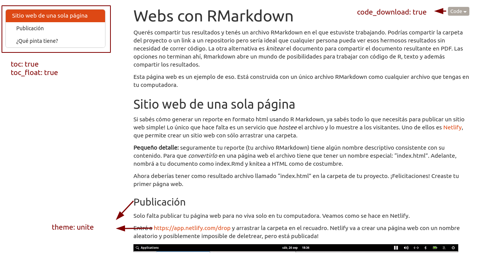

```{r setup, include=FALSE}
knitr::opts_chunk$set(echo = TRUE)
```

Querés compartir tus resultados y tenés un archivo RMarkdown en el que estuviste trabajando. Podrías compartir la carpeta del proyecto o un link a un repositorio pero sería ideal que cualquier persona pueda ver esos hermosos resultados sin necesidad de correr código. La otra alternativa es *knitear* el documento para compartir el documento resultante en PDF. Las opciones no terminan ahí, Rmarkdown abre un mundo de posibilidades para trabajar con código de R, texto y además compartir los resultados.

Esta página web es un ejemplo de eso. Está construida con un único archivo RMarkdown como cualquier archivo que tengas en tu computadora. 

## Sitio web de una sola página

Si sabés cómo generar un reporte en formato html usando R Markdown, ya sabés todo lo que necesitás para publicar un sitio web simple! Lo único que hace falta es un servicio que *hostee* el archivo y lo muestre a los visitantes. Uno de ellos es [Netlify](https://www.netlify.com/), que permite crear un sitio web con sólo arrastrar una carpeta. 

**Pequeño detalle:** seguramente tu reporte (tu archivo RMarkdown) tiene algún nombre descriptivo consistente con su contenido. Para que *convertirlo* en una página web el archivo tiene que tener un nombre especial: "index.html". Adelante, nombrá a tu documento como index.Rmd y knitea a HTML como de costumbre. 

Ahora deberías tener como resultado archivo llamado "index.html" en la carpeta de tu proyecto. ¡Felicitaciones! Creaste tu primer págna web.

### Publicación

Solo falta publicar tu página web para no viva solo en tu computadora. Veamos como se hace en Netlify.

Entrá a [https://app.netlify.com/drop](https://app.netlify.com/drop) y arrastrar la carpeta en el recuadro. Netlify va a crear una página web con un nombre aleatorio y posiblemente imposible de deletrear, pero está publicada!


<figure>
<video width=770px controls>
  <source src="img/netlify_drop.webm" type="video/webm">
</video>
</figure>


Tal vez notaste que Netlify borra los sitios web luego de 24 horas. Para que tu sitio sea permanente tenés que crearte una cuenta en Netlify. Eso además te va a permitir cambiarle el nombre a tu página, por ejemplo migranweb.netlify.app

### ¿Qué pinta tiene?

Ahora que cubrimos los principios básicos de como publicar la página web, podemos concentrarnos en lo importante, el aspecto! (y por supuesto el contenido :) ).

La pinta de cualquier archivo RMarkdown se controla desde el encabezado o YAML y en este caso vamos a modificar algunas opciones del `output`. 

El YAML de esta web tiene la siguiente pinta:

```
---
title: "Webs con RMarkdown"
output: 
  html_document:
    code_download: true
    toc: true
    toc_float: true
    theme: unite                                                     
---
```

* **title** es justamente el título de la web y se muestra como encabezado de primera categoría.
* **code_download** genera ese pequeño botón arriba a la derecha que permite descargar el código fuente de la página. Esto es muy práctico si queremos que las personas que visitan la página pueda descargar el archivo y correrlo localmente.
* **toc** genera una tabla de contenidos y **toc_float** la muestra a la izquierda y hace más simple la navegación.
* Finalmente **theme** permite cambiar el aspecto general de la página (por ejemplo el color de los links y el tipo de letra) y hay varios que viene listos para usar en el paquete {rmarkdown}: default, cerulean, journal, flatly, darkly, readable, spacelab, united, cosmo, lumen, paper, sandstone, simplex, y yeti. Podés verlos en acción [acá](https://bootswatch.com/3/).

